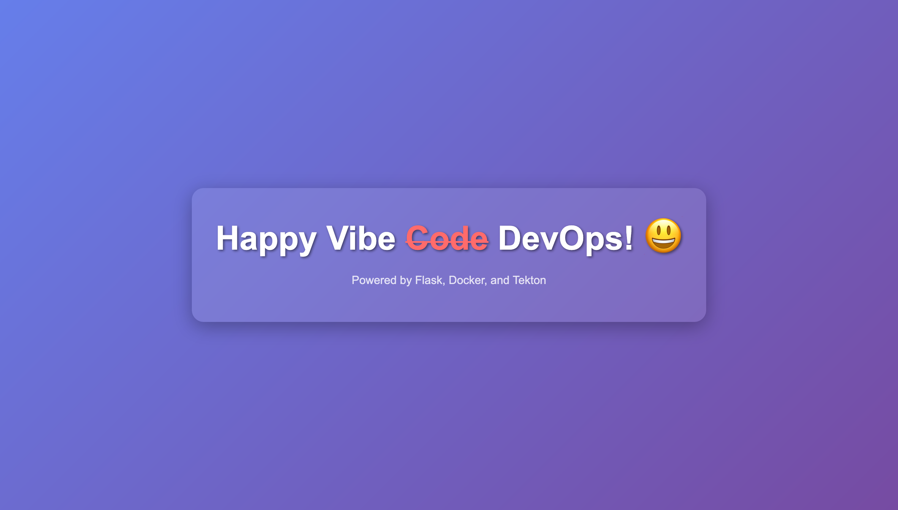

# Vibe DevOps

Experiment to leverage Claude Code for generating Tekton manifests and applying them based on input prompts.



---

## Prerequisites

- [Podman](https://podman.io/) Runtime & CLI
- [Kind](https://kind.sigs.k8s.io/)
- [kubectl](https://kubernetes.io/docs/reference/kubectl/)
- Claude Code CLI

---

## Environment Setup

### 1. Allow Insecure Local Registry
Append the following to the Podman VM's `registries.conf`:

```toml
[[registry]]
location = "localhost:5001"
insecure = true
```

```sh
podman machine ssh --username root <podman-machine-name>
vi /etc/containers/registries.conf
```

### 2. Create Kubernetes Cluster with Kind

```sh
kind create cluster --name claude-tekton --config 00-environment/kind-config.yaml
```

### 3. Install Tekton Pipelines

```sh
kubectl apply --filename https://storage.googleapis.com/tekton-releases/pipeline/latest/release.yaml
```

### 4. Start Local Registry

```sh
podman rm -f registry || true
podman run -d --restart=always -p 5001:5000 --name registry registry:latest
```

### 5. Install Local Git Server (Gitea)

```sh
helm repo add gitea-charts https://dl.gitea.io/charts/
helm repo update
helm install gitea gitea-charts/gitea \
  --namespace git --create-namespace \
  --values 00-environment/gitea-values.yaml
```


---

## Seed Gitea with Sample Repository

```sh
kubectl create configmap gitea-seed-files \
  --from-file=app.py=01-app/app.py \
  --from-file=Dockerfile=01-app/Dockerfile \
  --from-file=deployment.yaml=01-app/deployment.yaml \
  -n git

kubectl apply -f 00-environment/gitea-seed.yaml
```

Monitor Gitea seed job logs:

```sh
kubectl -n git logs job/gitea-seed -f
```

Verify repository creation:

```sh
git ls-remote http://localhost:3000/gitea-admin/test-repo.git
```

---

## Test Configuration

### 1. Pull and Push Sample Image

```sh
podman pull nginx:alpine
podman tag nginx:alpine localhost:5001/nginx:alpine
podman push localhost:5001/nginx:alpine
```

### 2. Deploy to Kubernetes

```sh
kubectl apply -f 00-environment/deployment.yaml
```

### 3. Verify Deployment

```sh
kubectl get all
```

Create a namespace:

```sh
kubectl create ns happy-vibe-devops
```

---

## References

- [Configure image registries](https://podman-desktop.io/docs/containers/registries)
- [Claude Best Practices](https://www.anthropic.com/engineering/claude-code-best-practices)

---

## Tools

- [Asciinema Terminal recording](https://asciinema.org/)
- [Tmux Terminal Multiplexer](https://github.com/tmux/tmux/wiki)
- [iTerm2 - Mac Terminal Emulator](https://iterm2.com/)

